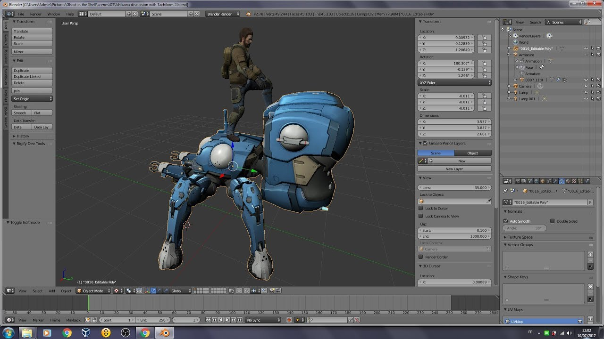

# OpenFirstAssault

## Ishikawa CH 0x01

This is just a readme file until I find a way to work easy with 3D and GITHUB, btw am follwing the [Ancient Beast community](https://ancientbeast.com/) game developpement as they use to work with 3D assets

BTW, if you want to play an FPS cyberpunk like just give a try to [Ironsight](https://fr.ironsight.aeriagames.com/) THX

# Assets

You'll find all the legal assets on my 3D modding account on sketchfab
https://sketchfab.com/thefailtheory

# Game

I will upload on Mega as soon as possible but you can come and take a look at the sate of my hacks
https://mega.nz/#F!MoUxQa6J!PuPWv5uULigINBGutEXfJA

There will be two important ZIP files, OpenFirstAssault.zip (unreal 4.22 project) and WindowsNoEditor.zip (conataining a build)

When you launch the game just click on Play then if you want to quit Alt + F4 it's the key binding by default on unreal

# Fan kit

Am a big fan of the manga since its early publications in the 90s but here it's about the FPS Game
https://mega.nz/#F!k8MQlKwD!ML61WpJQv3ewbavwP4N24w

# Videos

I was following the game since its launch and modded it my way according to the community guidelines
https://www.youtube.com/watch?v=o1hmdpfYgBc&list=PLhAVPXwuphwkeAkXbv8fQUIzZ37hSrkIQ

# Community

https://discord.gg/2SVTmXD
